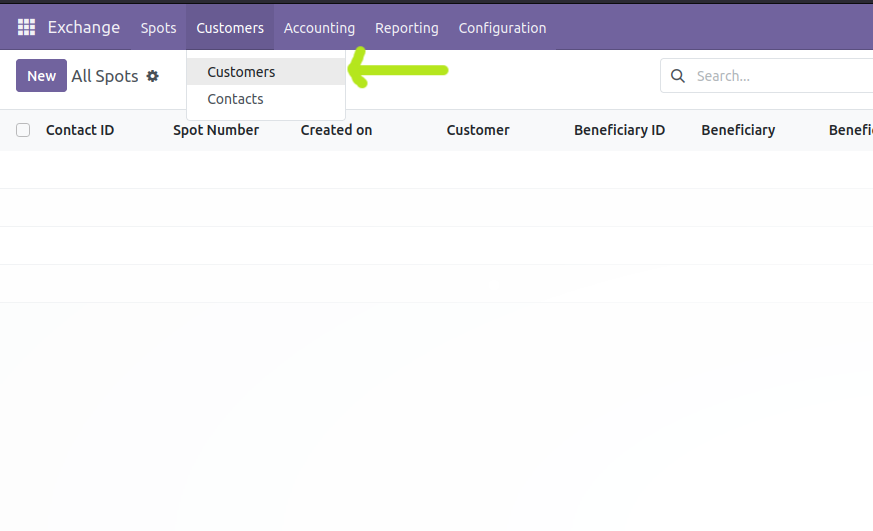

===============
Create Contacts
===============

To define a person in Moonsun Exchange, you can use the Customers section in the top menu of Moonsun Exchange.

    
Some fields are similar to contact application fields in Odoo. Other fields are described below.

- Multi Owner
- Is Agent
- Points
- Level
- Nickname
- Structure
- Referral ID
- Compliance Details
- Beneficiaries
- Referrals
- Related Contacts
- Metadata
- Sale&Purchase
- Accounting
- Internal notes
