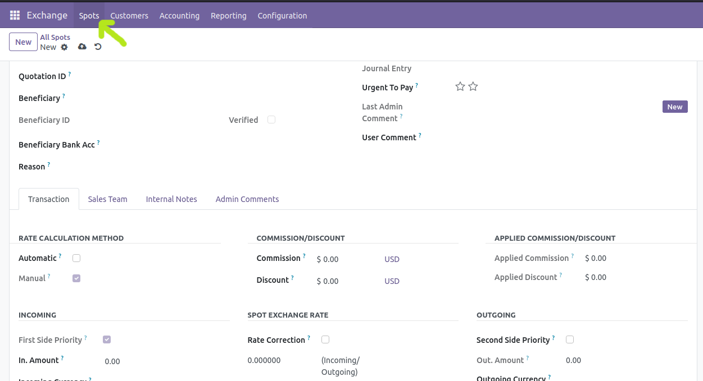
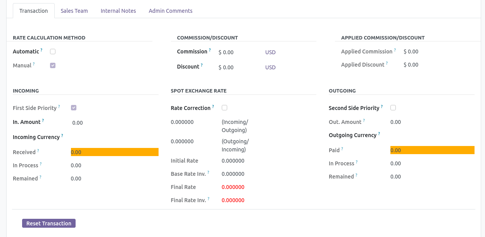

============
Create SPOT
============

The meaning of spot is a document that includes all the information of the receiver and the sender along with the amount of paid and received.

To create a spot from the Moonsun Exchange app, select the "Spot" option from the top menu. In the following, each section related to the definition of a spot is explained.

Type of Spot
------------

- Transfer: When two parties of a transfer (customer and beneficiary) are the same person.

- Exchange: When the two parties of a spot (customer and beneficiary) are different.

Customer-Beneficiary information and their bank account
-------------------------------------------------------

There are a number of field customer and beneficiary information and their bank account that are required to be filled.

Reason
------

Every spot is sent for a reason. To define the reasons for a spot, select the Spot Reasons option from the top menu in the configuration section. Define a number of reasons according to common reasons in your company.
Now you can choose a reason from the previously defined reasons when creating a spot.

Quotation ID
------------

Journal
-------

Journal Entry
-------------

Urgent To Pay
--------------

Each star indicates the importance of spot for payment. The higher the number of stars in a spot, the more important the spot is.

Last Admin Comment
------------------

User Comment
------------

Transaction section
--------------------

Transaction is the main part of the Exchange app. All received and paid amounts and calculation rates are specified in this section.

Rate calculation method
~~~~~~~~~~~~~~~~~~~~~~~

There are two ways to calculate the rate.

- Automatic: According to the rate you specified when defining the currency.

- Manual: According to the rate you specify manually.

Discount and commission calculation method
~~~~~~~~~~~~~~~~~~~~~~~~~~~~~~~~~~~~~~~~~~

In the Exchange app, you can manually select the amount of discount and commission for your employee.
All these items automatically affect the amounts after selection and there is no need for manual calculation by the exchange employee.