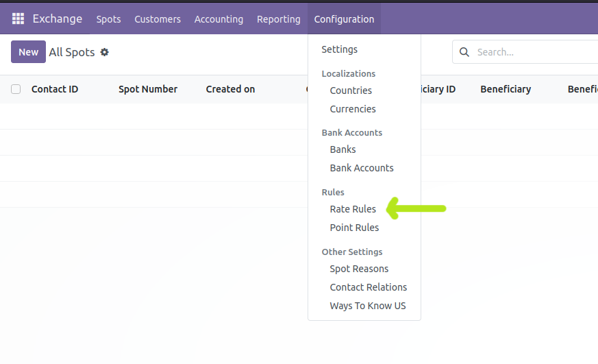
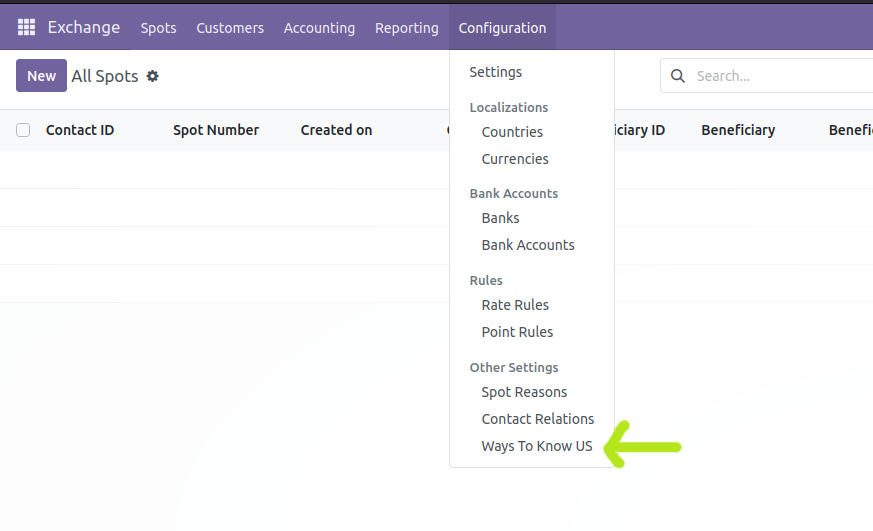

=======================
Prerequisites of a SPOT
=======================

In this section, the necessary settings for making a spot are explained. Before making a spot, make the following settings.

Rate Rule
---------
What is the rate rule?

To set the rate rule, follow the path below:

Top menu -> Configuration -> Rate Rule Section

Ways of knowing people
----------------------

To define the customer, it is necessary to specify the "How did you find us" field. Therefore, define all the used ways that are common in your company. For this,follow the path below:

Top menu -> Configuration -> Ways to know us Section

