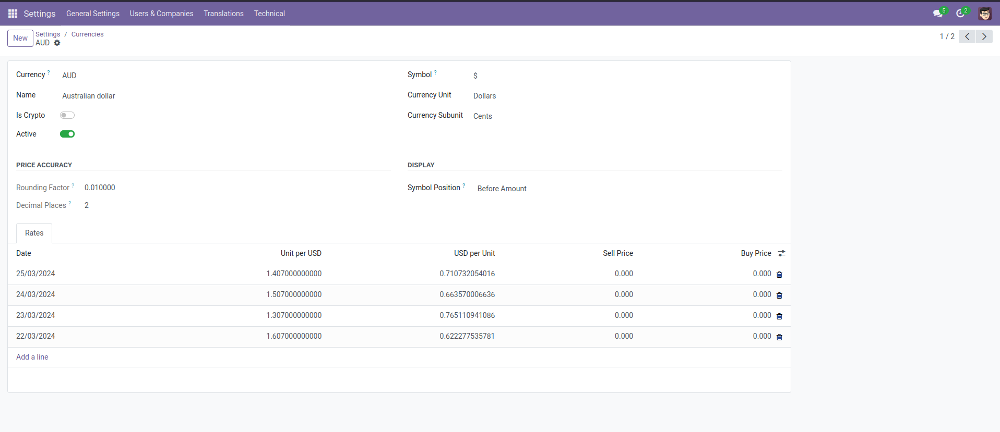
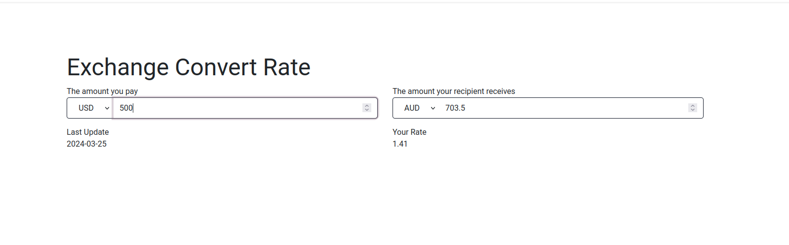

====================
Convert Rate snippet
====================

This snippet is a currency conversion calculator that uses the information of any currency that is active in your odoo system.
Refer to `this link <https://www.odoo.com/documentation/17.0/applications/finance/accounting/get_started/multi_currency.html>`_. to activate the desired currency and determine the amount of the currency on a daily basis.

For example, in the figure below, the changes in the exchange rate of the Australian dollar for the date of March 22 to March 25 are specified.

In the figure below, you can see an example of this currency conversion calculator.
In this example, we have converted 500 US dollars to Australian dollars at the rate set on March 25, 2024.

